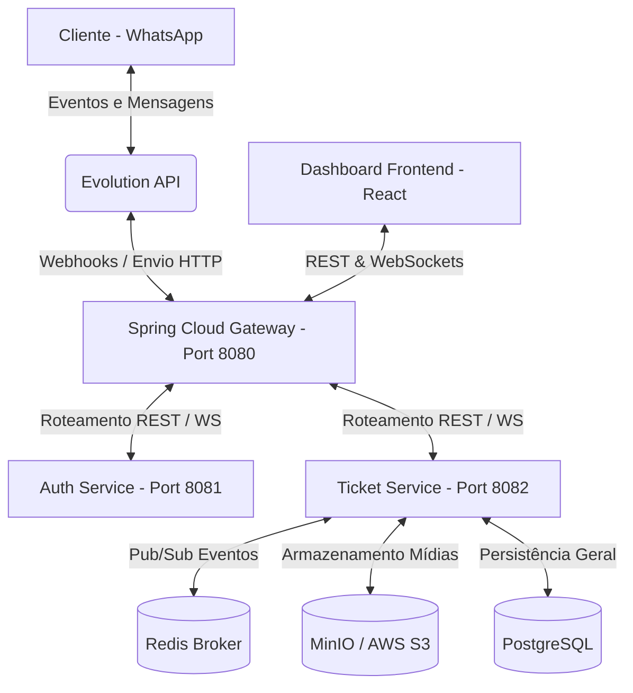

# 🚀 Setoriza — Automação de Atendimento & Chat Multiatendente via WhatsApp

O **Setoriza** é uma plataforma corporativa de atendimento ao cliente via WhatsApp de alta performance, desenhada para centralizar e automatizar o contato operacional em múltiplos departamentos. O sistema integra um chatbot interativo de triagem automatizada com uma interface multiatendente em tempo real, permitindo que operadores humanos assumam salas de chat diretamente do navegador e gerenciem filas por setor com segurança e controle.

A solução foi desenvolvida sob uma arquitetura resiliente de microsserviços, utilizando **Spring Boot 3** no ecossistema Java, **React 18** com TypeScript no frontend, banco relacional **PostgreSQL**, e brokers como **Redis** e **WebSockets** para a entrega instantânea de dados.

---

## 🗺️ Arquitetura de Microsserviços



1. **Spring Cloud Gateway (Porta 8080):** Porta de entrada unificada da infraestrutura. Gerencia o roteamento de microsserviços, políticas de segurança, conexões WebSockets e rate limiting.
2. **Auth Service (Porta 8081):** Centralizador de autenticação (JWT) e governança de colaboradores. Mapeia papéis (`MASTER`, `ADMIN`, `USER`) e define as permissões de acesso aos setores.
3. **Ticket Service (Porta 8082):** Motor central de controle de atendimentos. Gerencia o ciclo de vida dos chamados (triagem, fila, ativo, encerrado), motor de mensagens, regras de SLA e a integração de WebSockets.
4. **Evolution API:** Interface externa de conexão com o WhatsApp oficial ou não-oficial, traduzindo eventos do protocolo de mensagens em chamadas de webhooks HTTP.

---

## 🌟 Funcionalidades Principais

### 🤖 1. Chatbot de Triagem & Direcionamento Reativo
* Sempre que um cliente inicia um contato no WhatsApp, o chatbot o recebe e ativa uma máquina de estados interativa.
* Apresenta um menu configurável de setores (ex: `1 - DP`, `2 - Fiscal`, `3 - Contábil`).
* Assim que o cliente faz a seleção numérica, o sistema atualiza o status do chamado para `AGUARDANDO_ATENDIMENTO` e o direciona para a fila do respectivo setor.

### 👥 2. Interface Multiatendente em Tempo Real
* Operadores visualizam filas setoriais atualizadas instantaneamente via **WebSockets** (`SockJS` / `Stomp`).
* Um operador pode "Capturar" um chamado da fila geral, passando-o para o status `EM_ANDAMENTO` e iniciando a conversa humana de forma reativa.
* Suporta o envio e recebimento de mídias estruturadas (imagens, PDFs, documentos e áudios) integradas ao ecossistema S3.

### 🔀 3. Transferência Avançada (Setor + Operador)
* Permite que operadores transfiram chamados tanto para a fila geral de outro setor, quanto para um **colaborador específico** daquele setor que esteja logado, simplificando encaminhamentos internos.

### 🆕 4. Abertura de Chamados Ativos (Outbound)
* O atendente humano pode iniciar uma conversa do zero diretamente do painel fornecendo o número do WhatsApp.
* Conta com **autocomplete inteligente**, que busca no banco de dados e sugere a razão social do cliente à medida que o atendente digita, associando o contato automaticamente ao chamado aberto.

### 📊 5. SLA Dinâmico & Encerramento Automático
* **SLA de Fila:** Monitoramento do tempo de espera antes do chamado ser capturado por setor.
* **Encerramento por Inatividade:** Administradores podem configurar individualmente por setor o tempo tolerado de inatividade (sem novas mensagens do cliente ou atendente).
* O chatbot entra em ação enviando uma **mensagem prévia de aviso (via SISTEMA)** ao cliente e, caso a inatividade persista, conclui o chamado e atualiza o histórico.

### 🏛️ 6. Histórico Completo de Conversas
* Tela exclusiva de auditoria com busca paginada e filtros inteligentes por período de datas, atendente, status do chamado e cliente.
* Permite ler toda a conversa transcorrida no passado com botões dinâmicos de retorno.

### 🔌 7. Painel de Conectores (WhatsApp QR Code)
* Permite que administradores criem e iniciem instâncias no WhatsApp Evolution API diretamente pelo painel administrativo, exibindo o QR Code na tela com atualização de conexão automática.

---

## 🛠️ Tecnologias Utilizadas

### Backend:
* **Java 21** e **Spring Boot 3.4.x**
* **Spring Cloud Gateway** (Roteamento de rotas e segurança de WebSocket)
* **Spring Data JPA** & **Flyway** (Gerenciamento e migrations de DB)
* **Spring Security** (Autenticação Stateless com JWT)
* **Redis** (Broker Pub/Sub de eventos de tempo real)
* **AWS S3 / MinIO** (Persistência segura de mídias compartilhadas)

### Frontend:
* **React 18** & **Vite** (Framework de build ultra-rápido)
* **TypeScript** (Tipagem estática robusta)
* **TailwindCSS** (Estilização premium, com suporte a temas Dark/Light nativos)
* **Zustand** (Gerenciamento de estado global simplificado)
* **SockJS & StompJS** (Handshake e conexão persistente WebSocket)
* **Lucide React** (Pacote de ícones modernos)

---

## 🚀 Como Executar o Projeto Locamente

### Pré-requisitos:
* **Docker** & **Docker Compose**
* **Java JDK 21** instalado
* **Node.js** (versão 18 ou superior) instalado
* **Maven** (opcional, pode usar o wrapper `./mvnw`)

### 1. Iniciar Infraestrutura Local (Docker Compose)
Na raiz do projeto, execute o Docker Compose para subir os bancos de dados PostgreSQL, Redis, MinIO e a Evolution API:
```bash
docker compose up -d
```

### 2. Inicializar os Bancos de Dados
Execute o script fornecido na raiz para criar os bancos de dados em lote no PostgreSQL:
```bash
# Para ambientes Windows (PowerShell):
./init-databases.ps1

# Para ambientes Unix/macOS:
./init-databases.sh
```

### 3. Executar o Backend (Microsserviços)
Abra três terminais separados ou execute em background nas respectivas pastas do diretório `Backend`:

* **Gateway Service (8080):**
  ```bash
  cd Backend/Gateway-service
  mvn spring-boot:run
  ```
* **Auth Service (8081):**
  ```bash
  cd Backend/Auth-service
  mvn spring-boot:run
  ```
* **Ticket Service (8082):**
  ```bash
  cd Backend/ticket-service
  mvn spring-boot:run
  ```

### 4. Executar o Frontend
Navegue até a pasta `frontend`, instale as dependências e inicie o servidor de desenvolvimento Vite:
```bash
cd frontend
npm install
npm run dev
```
Abra o navegador no endereço indicado (geralmente `http://localhost:5173`).

---

## 👥 Credenciais Padrão de Acesso (Seed)

* **Perfil Master:** `master@setoriza.com` / senha: `setoriza123` (Acesso total administrativo)
* **Perfil Admin:** `admin@setoriza.com` / senha: `setoriza123`
* **Perfil Operador:** `user@setoriza.com` / senha: `setoriza123` (Acesso apenas ao chat operacional)
