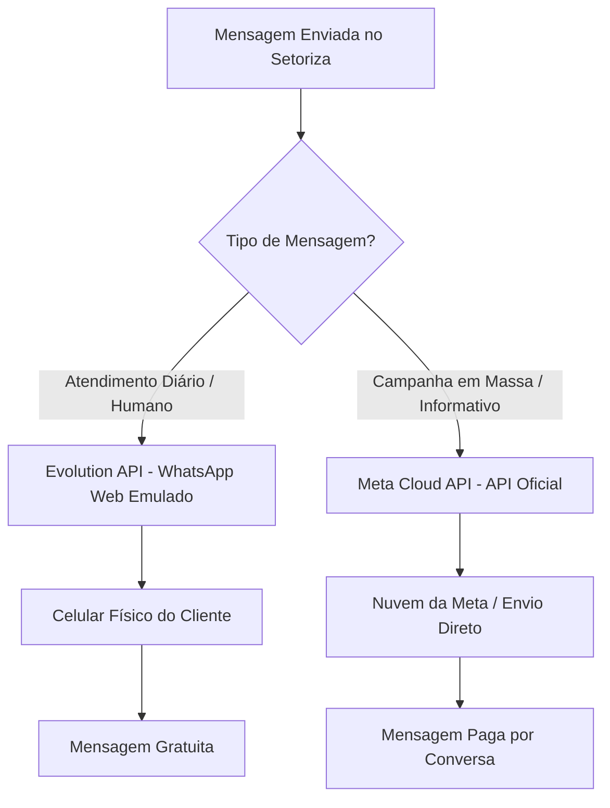

# Plano de Implementação — Modelo WhatsApp Híbrido (Evolution API + Meta Cloud API)

Este documento descreve o planejamento técnico para implementação do modelo híbrido de comunicação de WhatsApp na plataforma **Setoriza**. O objetivo é oferecer aos escritórios de contabilidade conversas diárias (suporte/atendimento) com custo zero (via Evolution API/WhatsApp Web) e disparos de informativos em massa estáveis e protegidos contra bloqueios (via Meta Cloud API).

---

## 🗺️ Visão Geral do Modelo Híbrido



---

## 🛠️ Etapa 1: Refatoração do Backend (ticket-service)

### 1.1. Atualização do Enum `WhatsAppApiType`
Devemos estender o enum de tipo de API para incluir o valor `HYBRID`.
* **Local:** `br.com.innkercode.ticket.domain.model.WhatsAppApiType.java`
```java
public enum WhatsAppApiType {
    EVOLUTION,
    META,
    HYBRID // <-- Novo tipo
}
```
* **Banco de Dados (Migration SQL):** Criar uma migration Flyway (`V11`) para adicionar/atualizar o tipo enumerado se o banco de dados utilizar PostgreSQL de forma nativa para enums.

### 1.2. Adaptação do Roteamento no `WhatsAppGatewayServiceImpl`
A classe responsável por direcionar as requisições de mensagens deve ser atualizada. Quando o canal estiver em modo `HYBRID`, os envios operacionais manuais (atendimento) serão realizados via Evolution API.
* **Local:** `br.com.innkercode.ticket.service.impl.WhatsAppGatewayServiceImpl.java`
```java
@Override
public String sendTextMessage(String number, String text) {
    WhatsAppConfig config = getGlobalConfig();
    if (config.getApiType() == WhatsAppApiType.HYBRID) {
        // Envio diário via Evolution API (Gratuito)
        return evolutionClient.sendTextMessage(number, text);
    }
    // Roteamento padrão anterior...
}
```
> [!NOTE]
> Replicar a mesma condicional para os métodos `sendMediaMessage` e `sendWhatsAppAudio`.

### 1.3. Prevenção de Duplicidade de Webhooks (Mensagens de Entrada)
Como o número de WhatsApp estará com a coexistência Meta ativa e a Evolution conectada, o backend receberá webhooks de ambas as APIs quando o cliente final enviar uma mensagem.
* **Estratégia de Resolução:**
  * O `ChatbotService` deve interceptar e ignorar webhooks da Meta API para mensagens recebidas quando o canal estiver configurado como `HYBRID`.
  * A **Evolution API** será a fonte única de verdade para mensagens de entrada (`incoming messages`) no modo híbrido, já que ela reflete perfeitamente o estado do WhatsApp Web.

---

## 📢 Etapa 2: Implementação do Módulo de Disparos em Massa (Meta API)

Diferente do atendimento diário, a ferramenta de transmissão (bulk messaging) deve forçar o uso da API Oficial da Meta para evitar o banimento da linha telefônica do cliente.

### 2.1. Criação do Serviço de Campanhas (`CampaignService`)
* **Responsabilidade:** Disparar mensagens informativas pré-aprovadas em lote para a lista de contatos do cliente.
* **Implementação Técnica:** O método de envio de campanhas chamará diretamente a classe `MetaWhatsAppClient`, ignorando o roteador genérico `WhatsAppGatewayService`.
```java
@Service
@RequiredArgsConstructor
public class CampaignService {
    private final MetaWhatsAppClient metaWhatsAppClient;
    private final WhatsAppConfigRepository whatsAppConfigRepository;

    public void broadcastTemplate(WhatsAppConfig config, List<String> phoneNumbers, String templateName, List<String> parameters) {
        for (String number : phoneNumbers) {
            // Força o disparo via API Oficial Meta Cloud
            metaWhatsAppClient.sendTemplateMessage(config, number, templateName, parameters);
        }
    }
}
```

---

## 💻 Etapa 3: Alterações no Frontend

### 3.1. Interface de Configuração do Canal (Admin)
No menu de configurações de conexão do WhatsApp, incluir a terceira opção:
* **Opções de Conexão:**
  * `Somente Evolution (Não Oficial - Gratuito)`
  * `Somente Meta (Oficial - Tarifado)`
  * `Modelo Híbrido (Atendimento Gratuito + Informativos Oficiais)`
* Quando `Modelo Híbrido` for selecionado:
  * Exibir o QR Code da Evolution para sincronização do celular.
  * Solicitar os campos de Token/ID de aplicativo da Meta API para configurar os disparos em massa.

### 3.2. Painel de Transmissão / Campanhas
Criar uma tela administrativa de "Informativos e Transmissões" que permita:
1. Escolher um modelo de mensagem pré-aprovado da Meta.
2. Selecionar o público-alvo (ex: "Todos os clientes ativos", "Apenas do Setor Pessoal").
3. Agendar ou disparar imediatamente em lote, exibindo os custos previstos e o status da entrega.

---

## 👥 Etapa 4: Escopo de Permissões e Segurança (SaaS Multi-tenant)

Para garantir a segurança da infraestrutura do SaaS Setoriza e dar autonomia de conexão aos clientes, a responsabilidade de configuração deve ser rigidamente separada entre os perfis `MASTER` e `ADMIN`:

### 4.1. Escopo do Administrador Global (`MASTER`)
O `MASTER` gerencia exclusivamente as configurações **globais e de infraestrutura**, ocultas para os clientes finais:
* **Endereço do Servidor Evolution API** (`EVOLUTION_API_URL`).
* **Chave Mestra da Evolution API** (`EVOLUTION_API_KEY`) utilizada pelo backend para criar instâncias via código.
* **Credenciais globais do aplicativo Meta Developer** (App Secret, etc.).
* **Monitoramento global** das instâncias ativas de todos os inquilinos (tenants).

### 4.2. Escopo do Administrador do Escritório (`ADMIN`)
O `ADMIN` de cada escritório de contabilidade gerencia apenas a **sua própria conexão de WhatsApp** (específica para o seu inquilino):
* **Visualização do QR Code:** Escaneamento para pareamento do celular físico do escritório (via Evolution API).
* **Gerenciamento do Canal Híbrido local:**
  * Inserção das chaves locais do Meta Business do escritório (Token de Acesso local, ID do Número de Telefone e ID da Conta do WhatsApp Business / WABA).
  * Seleção do tipo de canal preferencial (Somente Evolution, Somente Meta ou Híbrido).
* **Status da Conexão:** Tela para monitorar se o telefone do escritório está conectado, desconectado ou em sincronização.

---

## 🔒 Diretrizes de Segurança (Anti-Spam)
Embora as mensagens diárias sejam enviadas via Evolution API para contatos recorrentes (clientes da contabilidade), é importante seguir boas práticas para evitar bloqueios automáticos do algoritmo da Meta:
1. **Mensagens Humanas:** Evitar disparos automáticos massivos de robôs via Evolution API.
2. **Debounce no Chatbot:** O chatbot deve respeitar intervalos naturais de digitação humana (2 a 3 segundos) antes de responder ao cliente final.
3. **Opt-in de Informativos:** Para o disparo via Meta API, garanta que os clientes estejam cientes de que receberão informativos periódicos via WhatsApp.
