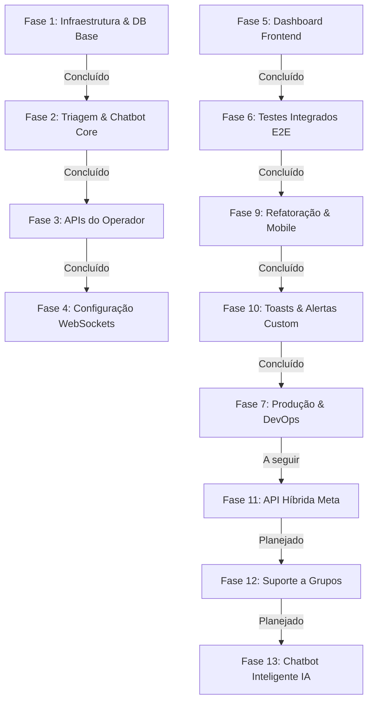

# 🚀 Roadmap de Desenvolvimento: Setoriza (WhatsApp Ticket Automation)

Este documento estabelece o roadmap completo, passo a passo, para guiar o desenvolvimento do **Setoriza** de ponta a ponta até a sua implantação em produção. O sistema foi desenhado sob uma arquitetura de microsserviços escalável e robusta para automatizar a triagem de atendimentos e gerenciar salas de chat em tempo real.

---

## 🗺️ Visão Geral do Fluxo de Trabalho

---

## 📋 2. Etapas de Desenvolvimento e Status

### 🐳 Fase 1: Infraestrutura Local & Modelagem de Dados
*Objetivo: Estabelecer o ambiente de desenvolvimento local isolado e as estruturas relacionais.*

- [x] **1.1 Configuração Docker Compose:** Setup do PostgreSQL, Redis cache, MinIO local e Evolution API.
- [x] **1.2 Script de Inicialização Automatizada:** Script de criação das databases em lote (`auth_db`, `ticket_db`, `evolution_db`).
- [x] **1.3 Resolução de Erros Críticos:** Correção de quebra de linhas no script shell e adição de variáveis de banco necessárias para a inicialização estável da Evolution API.
- [x] **1.4 Criação da Migration Base (Flyway):** Criação das tabelas `tickets` e `messages` com suporte a UUIDs, timestamps automáticos e índices de performance.

---

### 🤖 Fase 2: Triagem & Chatbot Core
*Objetivo: Habilitar o canal de entrada de mensagens do WhatsApp, direcionamento automático de setor e persistência de mídias.*

- [x] **2.1 Rota Pública Ingress (Gateway):** Liberação de bypass de segurança JWT no `JwtGlobalFilter` do Gateway para o path `/api/v1/webhooks/**`.
- [x] **2.2 Mapeamento do Webhook:** Desenvolvimento do DTO `WebhookPayload` mapeando o padrão de JSON enviado pela Evolution API.
- [x] **2.3 Cliente Evolution API:** Criação do `EvolutionClient` para disparo reativo de mensagens via HTTP utilizando `RestClient` do Spring.
- [x] **2.4 Chatbot de Triagem:** Implementação da máquina de estados do chatbot:
  - Criação do ticket ativo no status `TRIAGEM`.
  - Disparo do menu interativo de opções (`1 - Fiscal`, `2 - DP`, `3 - Contábil`, `4 - Societário`).
  - Atualização do status para `AGUARDANDO_ATENDIMENTO` e designação do setor correto com base na escolha numérica.
- [x] **2.5 Integração com MinIO (S3):** Implementação de download de mídias temporárias recebidas no WhatsApp e persistência definitiva de imagens, áudios e documentos no bucket `setoriza-medias`.
- [x] **2.6 Broadcast de Mensagens (Redis PubSub):** Acoplamento do `TicketEventPublisher` no `TicketService` e `MessageService` para publicação de eventos no Redis PubSub.

---

### 💼 Fase 3: APIs do Operador
*Objetivo: Desenvolver endpoints REST para permitir o controle humano de chamados por atendentes logados no sistema.*

- [x] **3.1 Endpoints de Gerenciamento de Tickets:**
  - `GET /api/v1/tickets`: Listar tickets por status (`AGUARDANDO_ATENDIMENTO`, `EM_ANDAMENTO`), setor ou atendente.
  - `POST /api/v1/tickets/{id}/claim`: Vincular o atendente (obtendo o ID do usuário dos cabeçalhos `X-User-Id` propagados pelo gateway) e alterar status para `EM_ANDAMENTO`.
  - `POST /api/v1/tickets/{id}/resolve`: Concluir o ticket, fechando a sessão de chat e permitindo novas interações do cliente.
  - `POST /api/v1/tickets/outbound`: Rota ativa (outbound) para operador abrir chamados inserindo número de WhatsApp, nome e vinculando a setores/atendentes.
- [x] **3.2 Endpoints de Mensagens & Resposta Humana:**
  - `GET /api/v1/tickets/{id}/messages`: Recuperar o histórico de mensagens trocadas para alimentar a tela de chat do atendente.
  - `POST /api/v1/tickets/{id}/messages`: Receber a resposta do atendente, disparar para Evolution API (com suporte a mídias Base64 e uploads S3) e registrar log como `SenderType.COLABORADOR`.
- [x] **3.3 Transferência Avançada e Atribuição:**
  - [x] Mapeamento de transferência dupla (Setor + Operador específico vinculado ao setor) e fallback para fila geral.
- [x] **3.4 Filtro Dinâmico de Histórico (Specification):**
  - [x] Implementação de busca paginada via `Specification` (JPA) no backend filtrando por datas, cliente, setor, atendente e status.
- [x] **3.5 Eventos de Painel:**
  - Disparar eventos via Redis PubSub de todas as ações (`TICKET_CLAIMED`, `TICKET_RESOLVED`, `MESSAGE_SENT_BY_AGENT`) para propagação nas telas do painel.

---

### ⏳ Fase 4: WebSockets & Ajustes de Gateway
*Objetivo: Integrar as sessões WebSockets com segurança e possibilitar conexões diretas através do Gateway.*

- [x] **4.1 Rota WebSocket no Gateway:** Configuração do roteamento do Spring Cloud Gateway para suportar conexões WebSocket persistentes (`ws://` ou `wss://`) direcionadas ao endpoint `/api/v1/ws/**` do `ticket-service`.
- [x] **4.2 Segurança no Socket:** Validação de tokens JWT na fase de handshake do WebSocket obtendo parâmetros de query ou cabeçalhos de inicialização.
- [x] **4.3 Teste Unitário & Mock do Redis Broker:** Criar testes automatizados para atestar a recepção múltipla de mensagens através do broker Redis PubSub.

---

### 💻 Fase 5: Dashboard Frontend & Painel Administrativo
*Objetivo: Construir a interface visual do atendente onde as salas de chat estarão disponíveis e o painel do administrador.*

- [x] **5.1 Tecnologias Sugeridas:** React + Vite + TypeScript (com TailwindCSS e Shadcn/UI para design premium). Configuração de ativos (logo/favicon), index.css, tema nativo e setup inicial concluídos com sucesso.
- [x] **5.2 Telas do Operador:**
  - [x] **Tela de Login:** Integração com o `auth-service` para captura de tokens JWT.
  - [x] **Listagem de Chamados (Sidebar):** Atualização instantânea com novos chamados entrantes (triados) utilizando conexão WebSocket no tópico `/topic/tickets`.
  - [x] **Área de Chat (Inbox):** Exibição reativa das mensagens enviadas e recebidas. Roteamento dinâmico baseado no ID do ticket selecionado e subscrição WebSocket em `/topic/tickets/{ticketId}`.
  - [x] **Barra de Ações:** Botão para assumir chamado ("Capturar"), transferir de setor/operador de forma dinâmica, e finalizar atendimento ("Concluir").
  - [x] **Abertura de Chamado Ativo:** Modal de criação de ticket com busca e autocomplete inteligente por nome ou WhatsApp de clientes cadastrados.
  - [x] **Histórico de Tickets (Operador):** Tela inteira em formato de tabela com filtros de pesquisa e ação de visualizar conversas com botão de retorno condicional.
- [x] **5.3 Painel Administrativo / Master (`/admin`):**
  - [x] **Dashboard de Métricas:** Estatísticas em tempo real, volumetria por setor e desempenho de SLA.
  - [x] **Colaboradores:** Listagem e formulário de criação/edição de novos atendentes com papéis (`USER`, `ADMIN`, `MASTER`) e setores autorizados.
  - [x] **Clientes Corporativos:** Cadastro de empresas parceiras (razão social cnpj) e vinculação de múltiplos números de WhatsApp autorizados.
  - [x] **Gerenciador de Conectores (WhatsApp):** Painel interativo integrado à Evolution API, com criação automática de instância, exibição do QR Code na tela e atualização reativa do status por polling em tempo real.
  - [x] **Painel de Histórico Completo (Admin):** Visualização geral de todos os chamados encerrados ou em andamento com filtros inteligentes.
  - [x] **Encerramento Automático de SLA:** Opções de liga/desliga de encerramento por inatividade configurável por setor com mensagem de aviso do chatbot.

---

### ⏱️ Fase 5.5: SLA & Automação de Inatividade (Encerramento)
*Objetivo: Evitar filas bloqueadas com atendimentos abandonados ou inativos.*

- [x] **5.5.1 Propagação de Configurações no Banco:** Flyway V4 adicionando configurações na tabela de setores e flags de alertas nos tickets.
- [x] **5.5.2 Motor de Encerramento (AutoCloseScheduler):** Execução a cada 1 minuto verificando inatividade por mensagens e executando ações do chatbot:
  - Enviar aviso prévio com mensagem do chatbot configurada (remetente `SISTEMA`).
  - Encerrar o atendimento caso o tempo limite de inatividade expire.
- [x] **5.5.3 UI de Gerenciamento:** Inputs dinâmicos na tela de criação/edição de setores para ativar o recurso e definir tempos limites.

---

### 🧪 Fase 6: Testes Integrados E2E & Segurança
*Objetivo: Garantir a resiliência do sistema e simular cenários de alta concorrência.*

- [x] **6.1 Fluxo Ponta a Ponta:**
  - [x] Simular mensagem de entrada via cURL imitando o webhook da Evolution API.
  - [x] Verificar a resposta automática do bot e a alteração do banco.
  - [x] Simular captura e resposta por parte do atendente verificando a recepção no WhatsApp final.
  - [x] Testar histórico ("Fechados") e reabertura de tickets concluídos.
- [x] **6.2 Rate Limiting:** Validar o controle de requisições configurado no gateway do Redis contra ataques de DDoS.
- [x] **6.3 Robustez de Conexão:** Testar reconexão automática de WebSockets quando houver queda momentânea da rede ou reinício dos serviços de backend.

---

### 🌐 Fase 7: Produção & DevOps (Cloud Deploy) (Concluído Parcial - Pronto para VPS)
*Objetivo: Preparar e implantar a aplicação na nuvem com segurança SSL e alta disponibilidade.*

- [x] **7.1 Otimização de Imagens Docker:** Criação de arquivos `Dockerfile` multi-stage para compilar e empacotar a aplicação de forma otimizada para produção.
- [x] **7.2 Orquestração:**
  - Ajustar o compose para modo de produção ou mapeamento Kubernetes/Docker Swarm.
  - Substituir senhas padrão e credenciais locais por injeção segura de Secrets.
- [x] **7.3 Servidor de Ingress & SSL:** Setup do Nginx ou Traefik como Proxy Reverso, gerenciando a renovação automática de certificados SSL gratuitos via Let's Encrypt (Configuração base do Nginx e CI/CD prontas).
- [ ] **7.4 Estratégia de Backup:** Configurar rotinas de backup automatizadas diárias do banco PostgreSQL na nuvem.

---

### ⚡ Fase 8: Otimizações de Mídia e Armazenamento (Pós-Lançamento)
*Objetivo: Minimizar custos de S3/R2 através de compressão automática de arquivos e políticas de limpeza de dados.*

- [x] **8.1 Regras de Ciclo de Vida do S3 (R2):** Configurar políticas de expiração automática de objetos no bucket para remover mídias anexadas a chamados com mais de 90/180 dias.
- [x] **8.2 Compactação de Imagens (WebP):** Implementar conversão automática de imagens (PNG/JPG) para formato WebP com qualidade otimizada (80%) antes do upload para o bucket.
- [x] **8.3 Otimização de Áudios (Opus/WebM):** Garantir que os áudios gravados pelo microfone do operador no navegador sejam capturados estritamente usando o codec Opus (altamente comprimido para voz humana) em vez de formatos brutos e pesados como WAV.

---

### 🎨 Fase 9: Refatoração, Modularização & Suporte Mobile
*Objetivo: Desacoplar a visualização monolítica em componentes reutilizáveis e otimizar a experiência em dispositivos móveis.*

- [x] **9.1 Decomposição do Chat.tsx:** Segmentar a visualização monolítica em subcomponentes reutilizáveis (`ChatSidebar`, `ChatArea`, `ChatDetails`).
- [x] **9.2 Decomposição do Admin.tsx:** Segmentar a visualização monolítica em subcomponentes reutilizáveis (`AdminDashboard`, `AdminUsers`, `AdminClients`, `AdminIntegrations`, `AdminSectors`, `AdminHistory`).
- [x] **9.3 Responsividade Mobile Completa:** Implementar sidebar colapsável com controle hambúrguer, overlay e grids flexíveis de cards com paginação isolada no mobile.
- [x] **9.4 Otimização de Performance:** Refinar seletores e imports para evitar re-renderizações indesejadas e garantir compilação stricta sem warnings.
- [x] **9.5 Histórico de Transferências (Linha do Tempo):** Implementação de gavetas (accordions) colapsáveis na barra lateral e renderização dinâmica da linha do tempo das transferências do ticket.
- [x] **9.6 Validação de Reabertura Limitada (Janela de 24h):** Restringir a reabertura manual de chamados concluídos a uma janela máxima de 24 horas, bloqueando a ação no backend e desabilitando o botão correspondente no frontend.
- [x] **9.7 Logs de Sistema na Transferência:** Disparar e registrar mensagens automáticas internas de sistema (`SISTEMA`) no chat detalhando transferências de setores e atendentes para contexto dos operadores.
- [x] **9.8 Unificação Visual do Painel Admin:** Aplicar o sistema de design glassmorphic e translúcido com as cores operacionais em todas as sub-telas do menu de administração.
- [x] **9.9 Navegação "Ver Conversa" no Histórico Admin:** Inserir ação de visualização de conversa na tabela desktop e cards mobile que redireciona o administrador diretamente ao chat com o ticket carregado.
- [x] **9.10 Histórico de Chamados Responsivo (Cards Mobile):** Implementar visualização em cards responsivos para o histórico operacional no painel do atendente (/chat).

---

### 🔔 Fase 10: Camada de Notificações Internas (Toasts & Alertas Customizados) (Concluído)
*Objetivo: Substituir os popups nativos do navegador (`alert`, `confirm`) por componentes modais e toasts animados integrados ao visual da plataforma.*

- [x] **10.1 Criação do Contexto de Toast (Notificações):** Estruturar o `ToastProvider` e hook `useToast` para gerenciamento em lote de mensagens temporárias de sucesso, erro e alertas flutuantes no canto da tela.
- [x] **10.2 Modais de Confirmação Personalizados (Confirmations):** Substituir a função nativa `window.confirm` (usada em deleções de clientes, conexões ou exclusões de contatos) por um modal de confirmação premium estilizado com nosso design dark/light.
- [x] **10.3 Integração em Lote no Frontend:** Substituir as chamadas de alertas, modais e mensagens de erro do sistema de API pelas novas instâncias de Toasts/Modais customizados nos módulos Chat e Admin.

---

### 📲 Fase 11: Integração Híbrida com API Oficial da Meta (A Seguir)
*Objetivo: Permitir o uso integrado e alternável da API oficial do WhatsApp (Cloud API da Meta) e a Evolution API.*

- [ ] **11.1 Abstração do Canal de Envio (Interface):** Definir uma interface de serviço unificada no `ticket-service` (ex: `WhatsAppGatewayService`) para encapsular o disparo de mensagens, mídias e templates independentemente da API selecionada.
- [ ] **11.2 Cliente API Oficial da Meta:** Desenvolver o cliente HTTP no Spring Boot integrado com a API Cloud do Graph da Meta (envio de texto, templates pré-aprovados e mídias).
- [ ] **11.3 Webhook Receptor da Meta:** Implementar o endpoint de webhook específico para receber e descriptografar os payloads enviados pelos servidores da Meta.
- [ ] **11.4 Escolha Híbrida do Cliente:** Criar campo de configuração no cadastro do cliente corporativo (Admin) para selecionar se ele utiliza a Evolution API ou a API oficial da Meta, alternando o roteamento da mensagem dinamicamente no backend.

---

### 👥 Fase 12: Suporte a Grupos & Intercepção por Hashtags (Planejado)
*Objetivo: Possibilitar a abertura de chamados no painel a partir de mensagens enviadas em grupos de WhatsApp.*

- [ ] **12.1 Roteamento por remoteJid:** Adaptar o `TicketService` e a persistência do banco de dados para diferenciar conversas privadas (`@s.whatsapp.net`) de mensagens em grupos (`@g.us`).
- [ ] **12.2 Intercepção por Hashtags:** Desenvolver filtro no backend para escutar grupos de WhatsApp autorizados e, caso um participante envie uma tag chave (ex: `#fiscal`, `#dp`), criar um chamado na fila do setor correspondente.
- [ ] **12.3 Mensagens de Fora de Horário & Respostas em Grupo:** Configurar mensagens de ausência e disparos automáticos para grupos quando o atendimento for iniciado ou fora do horário comercial.

---

### 🧠 Fase 13: Chatbot Inteligente com IA (Planejado)
*Objetivo: Integrar grandes modelos de linguagem (LLMs) para responder dúvidas frequentes e refinar a triagem automática.*

- [ ] **13.1 Cliente de Integração com LLM:** Desenvolver integração com a API da OpenAI (GPT), Anthropic (Claude) ou Google (Gemini) no `ticket-service`.
- [ ] **13.2 Base de Conhecimento e Prompting:** Estruturar sistema de contexto/RAG para o robô responder com precisão baseando-se em documentos da empresa.
- [ ] **13.3 Classificação Inteligente de Setor:** Utilizar IA para interpretar a solicitação inicial em linguagem natural do cliente e direcioná-lo automaticamente ao setor correto.
