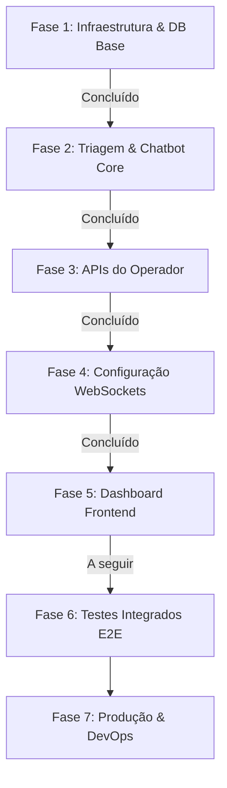

# 🚀 Roadmap de Desenvolvimento: Setoriza (WhatsApp Ticket Automation)

Este documento estabelece o roadmap completo, passo a passo, para guiar o desenvolvimento do **Setoriza** de ponta a ponta até a sua implantação em produção. O sistema foi desenhado sob uma arquitetura de microsserviços escalável e robusta para automatizar a triagem de atendimentos e gerenciar salas de chat em tempo real.

---

## 🗺️ Visão Geral do Fluxo de Trabalho

---

## 📋 2. Etapas de Desenvolvimento e Status

### 🐳 Fase 1: Infraestrutura Local & Modelagem de Dados
*Objetivo: Estabelecer o ambiente de desenvolvimento local isolado e as estruturas relacionais.*

- [x] **1.1 Configuração Docker Compose:** Setup do PostgreSQL, Redis cache, MinIO local e Evolution API.
- [x] **1.2 Script de Inicialização Automatizada:** Script de criação das databases em lote (`auth_db`, `ticket_db`, `evolution_db`).
- [x] **1.3 Resolução de Erros Críticos:** Correção de quebra de linhas no script shell e adição de variáveis de banco necessárias para a inicialização estável da Evolution API.
- [x] **1.4 Criação da Migration Base (Flyway):** Criação das tabelas `tickets` e `messages` com suporte a UUIDs, timestamps automáticos e índices de performance.

---

### 🤖 Fase 2: Triagem & Chatbot Core
*Objetivo: Habilitar o canal de entrada de mensagens do WhatsApp, direcionamento automático de setor e persistência de mídias.*

- [x] **2.1 Rota Pública Ingress (Gateway):** Liberação de bypass de segurança JWT no `JwtGlobalFilter` do Gateway para o path `/api/v1/webhooks/**`.
- [x] **2.2 Mapeamento do Webhook:** Desenvolvimento do DTO `WebhookPayload` mapeando o padrão de JSON enviado pela Evolution API.
- [x] **2.3 Cliente Evolution API:** Criação do `EvolutionClient` para disparo reativo de mensagens via HTTP utilizando `RestClient` do Spring.
- [x] **2.4 Chatbot de Triagem:** Implementação da máquina de estados do chatbot:
  - Criação do ticket ativo no status `TRIAGEM`.
  - Disparo do menu interativo de opções (`1 - Fiscal`, `2 - DP`, `3 - Contábil`, `4 - Societário`).
  - Atualização do status para `AGUARDANDO_ATENDIMENTO` e designação do setor correto com base na escolha numérica.
- [x] **2.5 Integração com MinIO (S3):** Implementação de download de mídias temporárias recebidas no WhatsApp e persistência definitiva de imagens, áudios e documentos no bucket `setoriza-medias`.
- [x] **2.6 Broadcast de Mensagens (Redis PubSub):** Acoplamento do `TicketEventPublisher` no `TicketService` e `MessageService` para publicação de eventos no Redis PubSub.

---

### 💼 Fase 3: APIs do Operador
*Objetivo: Desenvolver endpoints REST para permitir o controle humano de chamados por atendentes logados no sistema.*

- [x] **3.1 Endpoints de Gerenciamento de Tickets:**
  - `GET /api/v1/tickets`: Listar tickets por status (`AGUARDANDO_ATENDIMENTO`, `EM_ANDAMENTO`), setor ou atendente.
  - `POST /api/v1/tickets/{id}/claim`: Vincular o atendente (obtendo o ID do usuário dos cabeçalhos `X-User-Id` propagados pelo gateway) e alterar status para `EM_ANDAMENTO`.
  - `POST /api/v1/tickets/{id}/resolve`: Concluir o ticket, fechando a sessão de chat e permitindo novas interações do cliente.
- [x] **3.2 Endpoints de Mensagens & Resposta Humana:**
  - `GET /api/v1/tickets/{id}/messages`: Recuperar o histórico de mensagens trocadas para alimentar a tela de chat do atendente.
  - `POST /api/v1/tickets/{id}/messages`: Receber a resposta textual do atendente no dashboard, dispará-la de volta para o cliente no WhatsApp via `EvolutionClient` e salvar o log no banco local como `SenderType.COLABORADOR`.
- [x] **3.3 Eventos de Painel:**
  - Disparar eventos via Redis PubSub de todas as ações (`TICKET_CLAIMED`, `TICKET_RESOLVED`, `MESSAGE_SENT_BY_AGENT`) para propagação nas telas do painel.

---

### 🔄 Fase 4: WebSockets & Ajustes de Gateway
*Objetivo: Integrar as sessões WebSockets com segurança e possibilitar conexões diretas através do Gateway.*

- [x] **4.1 Rota WebSocket no Gateway:** Configuração do roteamento do Spring Cloud Gateway para suportar conexões WebSocket persistentes (`ws://` ou `wss://`) direcionadas ao endpoint `/api/v1/ws/**` do `ticket-service`.
- [x] **4.2 Segurança no Socket:** Validação opcional de tokens JWT na fase de handshake do WebSocket obtendo parâmetros de query ou cabeçalhos de inicialização.
- [x] **4.3 Teste Unitário & Mock do Redis Broker:** Criar testes automatizados para atestar a recepção múltipla de mensagens através do broker Redis PubSub.

---

### 💻 Fase 5: Dashboard Frontend (Painel Multiusuário) (Próximo Passo)
*Objetivo: Construir a interface visual do atendente onde as salas de chat estarão disponíveis.*

- [ ] **5.1 Tecnologias Sugeridas:** React + Vite + TypeScript (com TailwindCSS e Shadcn/UI para design premium).
- [ ] **5.2 Telas do Operador:**
  - **Tela de Login:** Integração com o `auth-service` para captura de tokens JWT.
  - **Listagem de Chamados (Sidebar):** Atualização instantânea com novos chamados entrantes (triados) utilizando conexão WebSocket no tópico `/topic/tickets`.
  - **Área de Chat (Inbox):** Exibição reativa das mensagens enviadas e recebidas. Roteamento dinâmico baseado no ID do ticket selecionado e subscrição WebSocket em `/topic/tickets/{ticketId}`.
  - **Barra de Ações:** Botão para assumir chamado ("Capturar"), transferir de setor, e finalizar atendimento ("Concluir").

---

### 🧪 Fase 6: Testes Integrados E2E & Segurança
*Objetivo: Garantir a resiliência do sistema e simular cenários de alta concorrência.*

- [ ] **6.1 Fluxo Ponta a Ponta:**
  - Simular mensagem de entrada via cURL/Postman imitando o webhook da Evolution API.
  - Verificar a resposta automática do bot e a alteração do banco.
  - Simular captura e resposta por parte do atendente verificando a recepção no WhatsApp final.
- [ ] **6.2 Rate Limiting:** Validar o controle de requisições configurado no gateway do Redis contra ataques de DDoS.
- [ ] **6.3 Robustez de Conexão:** Testar reconexão automática de WebSockets quando houver queda momentânea da rede ou reinício dos serviços de backend.

---

### 🌐 Fase 7: Produção & DevOps (Cloud Deploy)
*Objetivo: Preparar e implantar a aplicação na nuvem com segurança SSL e alta disponibilidade.*

- [ ] **7.1 Otimização de Imagens Docker:** Criação de arquivos `Dockerfile` multi-stage para compilar e empacotar a aplicação de forma otimizada para produção.
- [ ] **7.2 Orquestração:**
  - Ajustar o compose para modo de produção ou mapeamento Kubernetes/Docker Swarm.
  - Substituir senhas padrão e credenciais locais por injeção segura de Secrets.
- [ ] **7.3 Servidor de Ingress & SSL:** Setup do Nginx ou Traefik como Proxy Reverso, gerenciando a renovação automática de certificados SSL gratuitos via Let's Encrypt.
- [ ] **7.4 Estratégia de Backup:** Configurar rotinas de backup automatizadas diárias do banco PostgreSQL na nuvem.
